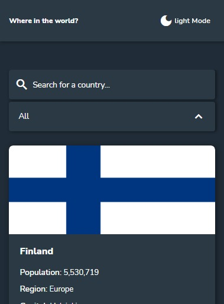

# Frontend Mentor - REST Countries API with color theme switcher solution

This is a solution to the [REST Countries API with color theme switcher challenge on Frontend Mentor](https://www.frontendmentor.io/challenges/rest-countries-api-with-color-theme-switcher-5cacc469fec04111f7b848ca).

## Table of contents

- [Overview](#overview)
  - [The challenge](#the-challenge)
  - [Screenshot](#screenshot)
  - [Links](#links)
- [My process](#my-process)
  - [Built with](#built-with)
  - [Available Scripts](#available-scripts)
- [Author](#author)

## Overview

### The challenge

Users should be able to:

- See all countries from the API on the homepage
- Search for a country using an `input` field
- Filter countries by region
- Click on a country to see more detailed information on a separate page
- Toggle the color scheme between light and dark mode

### Screenshot

### Links

- Solution URL: [https://github.com/davidolaoluwa240/Rest-Country](https://github.com/davidolaoluwa240/Rest-Country)
- Live Site URL: [https://rest-country-david.netlify.app/](https://rest-country-david.netlify.app/)

### Built with

- Semantic HTML5 markup
- Sass
- Flexbox
- CSS Grid
- Desktop-first workflow
- MVC Architecture
- Javascript
- Typescript
- Parcel
- Vitest

## Available Scripts

In the project directory, you can run:

### `npm start`

Runs the app in the development mode.\
Open [http://localhost:1234](http://localhost:1234) to view it in your browser.

The page will reload when you make changes.

### `npm test`

Launches the test runner.\
Learn more about [testing with vitest](https://vitest.dev/)

### `npm run build`

Builds the app for production to the `dist` folder.\
It correctly bundles the entire app in production mode and optimizes the build for the best performance.

## Author

- Website - [Atebisun David](https://david-portfolio-three.vercel.app/)
- Twitter - [@atebisun](https://www.twitter.com/atebisun)
